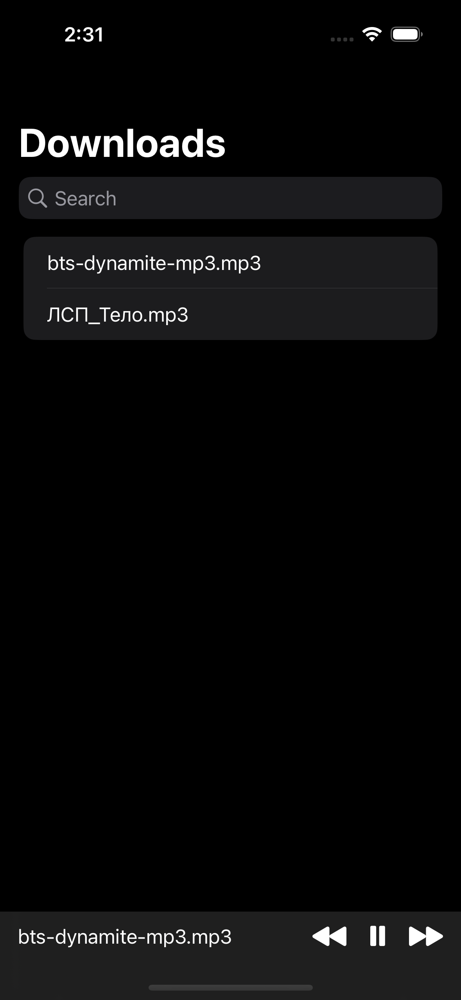
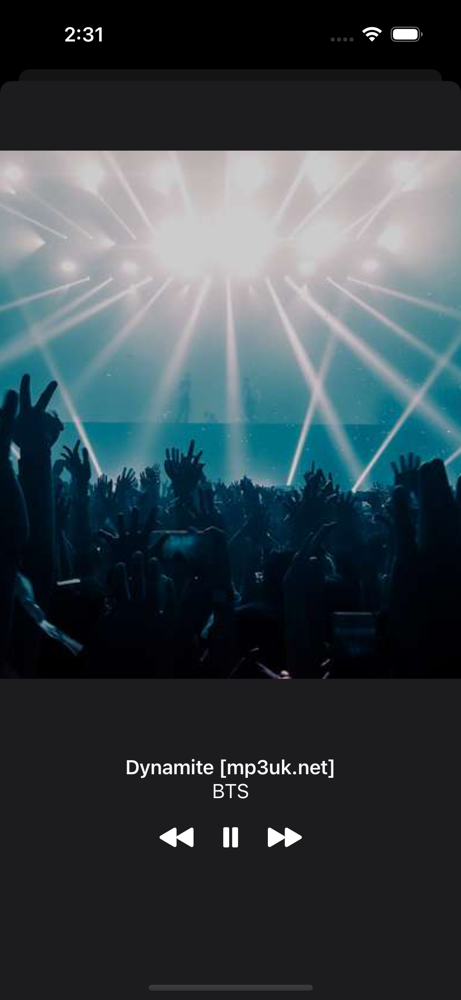

# Music

## Description

A Music player to listen .mp3 files from downloads folder. A lot of things aren't implemented, but the base is done and you can listen to the music.\
Needs a lot of refactoring. In future, I suppose, I will continue to develop this app.\
Also, I made a full UI in Sketch for such an app, that will contain music from Apple Music, but without Paid Apple Developer Account it is impossible to do such app.

## Screenshots

    

    

    

## P. S.

This app was created for my girlfriend, because there are no alternatives in App Store, that work OK and we were scared of Apple going away from Russia.
